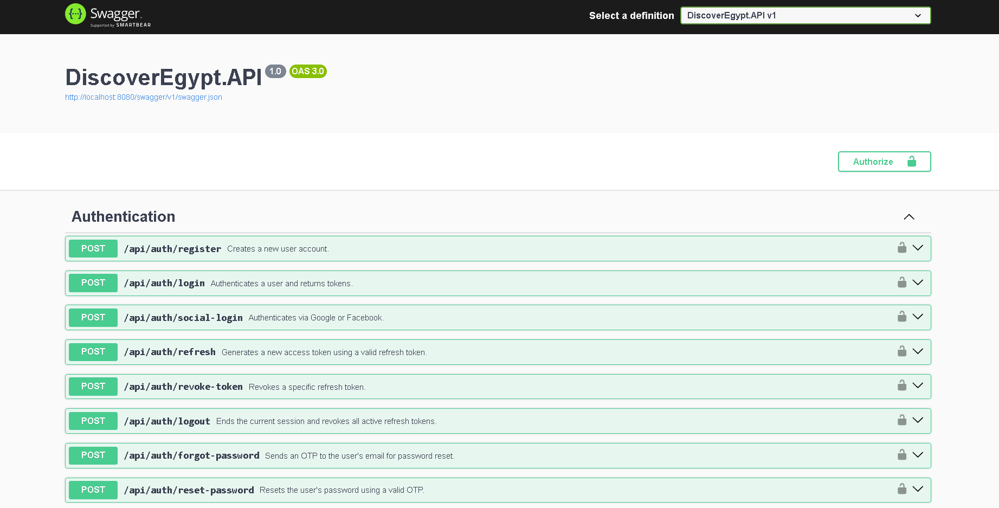

# Discover Egypt 🇪🇬

ASP.NET Core Web API for tourism discovery and travel planning in Egypt.

---

## 📌 Overview

Discover Egypt is a scalable backend application designed for tourists and travel experiences in Egypt.
The system provides authentication, trip planning, booking management, messaging, reviews, favorites, payment processing, and guide request features through a clean and modular architecture.

---

## 🚀 Features

### 🔐 Authentication & Authorization

* JWT Authentication
* Refresh Tokens
* Role-Based Authorization
* Forgot & Reset Password
* Social Login Support

### 👤 User Management

* User Profiles
* Change Password
* Role Assignment
* User Points System

### 🏝️ Places & Tourism

* Discover Tourist Places
* City & Category Filtering
* Place Reviews & Ratings
* Favorites System

### 🧳 Trips & Plans

* Ready Travel Plans
* Custom Travel Plans
* Plan Management

### 📅 Booking System

* Create & Manage Bookings
* Booking Confirmation
* Tourist & Guide Booking Flows

### 💳 Payments

* Visa Payment Processing
* Refund Handling
* Payment Tracking

### 💬 Conversations & Messaging

* Real-Time Style Messaging Structure
* Conversations Between Tourists & Guides
* Read Status Tracking

### 🔔 Notifications

* User Notifications
* Mark as Read
* Bulk Read Operations

### 🧭 Guide Requests

* Request Tour Guides
* Accept / Reject Requests
* Request Tracking

---

## 🛠️ Tech Stack

* ASP.NET Core Web API
* Entity Framework Core
* SQL Server
* ASP.NET Identity
* JWT Authentication
* AutoMapper
* Swagger / OpenAPI
* LINQ
* Dependency Injection

---

## 🧱 Architecture

The project follows a layered architecture approach:

```text
Client
   ↓
Controllers
   ↓
Services
   ↓
Repositories
   ↓
SQL Server Database
```

### Project Structure

```text
DiscoverEgypt.API
DiscoverEgypt.Core
DiscoverEgypt.Repository
DiscoverEgypt.Service
```

---

## 🔑 Authentication

The application uses:

* JWT Access Tokens
* Refresh Tokens
* Role-Based Authorization

Protected endpoints require Bearer Token authentication.

---

## 📷 API Documentation

### Authentication



### Bookings & Conversations


### Favorites & Messages


### Notifications & Nationalities


### Payments & Places


### Request Guide & Reviews


### Trips & Roles


### Users & User Roles


---

## ⚙️ Getting Started

### 1️⃣ Clone the repository

```bash
git clone https://github.com/husseinshaabanh/DiscoverEgypt.git
```

---

### 2️⃣ Configure appsettings

Update your configuration values inside:

```text
appsettings.Development.json
```

Example:

```json
{
  "ConnectionStrings": {
    "DefaultConnection": "YOUR_CONNECTION_STRING"
  },

  "JWT": {
    "Key": "YOUR_SECRET_KEY"
  }
}
```

---

### 3️⃣ Apply Migrations

```bash
Update-Database
```

---

### 4️⃣ Run the Application

```bash
dotnet run
```

Swagger will be available at:

```text
http://localhost:8080/swagger
```

---

## 📂 Main Modules

| Module         | Description                          |
| -------------- | ------------------------------------ |
| Authentication | Login, Register, JWT, Refresh Tokens |
| Places         | Tourist places management            |
| Trips          | Ready & Custom plans                 |
| Bookings       | Reservation system                   |
| Payments       | Payment & refund processing          |
| Reviews        | Reviews & ratings                    |
| Favorites      | User favorites                       |
| Conversations  | Messaging system                     |
| Notifications  | Notification management              |
| Roles          | Role management                      |
| Request Guide  | Guide request workflow               |

---

## 🔒 Security

* JWT Authentication
* Role-Based Access Control
* Protected API Endpoints
* Secure Password Handling

---

## 📈 Future Improvements

* Pagination
* FluentValidation
* Serilog Logging
* Redis Caching
* Docker Support
* Unit Testing
* CI/CD Pipeline

---

## 👨‍💻 Author

### Hussein Shaaban

ASP.NET Core Backend Developer

* GitHub: https://github.com/husseinshaabanh

---

## ⭐ Support

If you found this project useful, consider giving it a star ⭐
